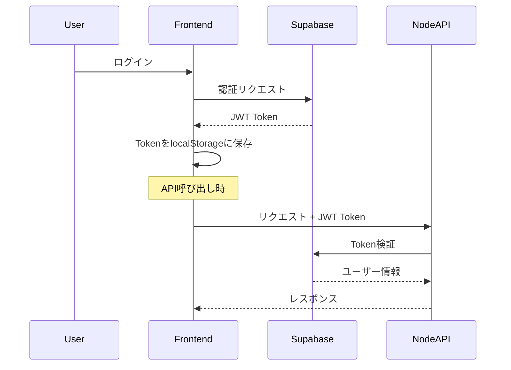

# Sofvo ハイブリッドアーキテクチャ設計

## 概要
SofvoアプリケーションはSupabaseとNode.js/Expressを組み合わせたハイブリッドアーキテクチャを採用します。

## アーキテクチャ構成

```
┌─────────────────────────────────────────────────┐
│                  Frontend (React)                │
│                                                  │
│  ┌──────────────┐        ┌──────────────────┐  │
│  │ Auth Context │        │  API Services    │  │
│  └──────────────┘        └──────────────────┘  │
└─────────────┬──────────────────┬────────────────┘
              │                  │
              ▼                  ▼
┌──────────────────────┐  ┌──────────────────────┐
│     Supabase         │  │   Node.js Backend    │
│                      │  │    (Express API)     │
│ • リアルタイムチャット │  │                      │
│ • メッセージDB        │  │ • ユーザー管理        │
│ • 通知（リアルタイム） │  │ • チーム管理         │
│ • 認証（共有）        │  │ • 大会管理           │
│                      │  │ • 静的データAPI      │
└──────────────────────┘  └──────────────────────┘
              │                  │
              ▼                  ▼
┌──────────────────────────────────────────────────┐
│            Shared Database (PostgreSQL)          │
│                                                  │
│  Supabase Tables        Node.js Tables          │
│  • messages             • tournaments            │
│  • conversations        • team_details           │
│  • notifications        • tournament_results     │
│  • profiles (shared)    • contact_inquiries      │
└──────────────────────────────────────────────────┘
```

## 責任分担

### Supabase（リアルタイム機能）
- **チャット機能**
  - リアルタイムメッセージング
  - 会話管理
  - 既読管理
- **リアルタイム通知**
  - プッシュ通知のトリガー
  - リアルタイム更新
- **認証基盤**
  - ユーザー認証（auth.users）
  - セッション管理

### Node.js Backend（ビジネスロジック）
- **チーム管理**
  - チーム作成・編集・削除
  - メンバー管理
  - 権限管理
- **大会管理**
  - 大会作成・編集
  - 参加者管理
  - 結果集計
- **ユーザー管理**
  - プロフィール詳細管理
  - 設定管理
  - 退会処理
- **その他**
  - お問い合わせ
  - レポート生成
  - 複雑なビジネスロジック

## 認証フロー



## 実装詳細

### 1. 認証の統合

Supabaseの認証をNode.jsバックエンドでも使用：

```javascript
// backend/src/middleware/supabase-auth.middleware.js
import { createClient } from '@supabase/supabase-js';

const supabase = createClient(
  process.env.SUPABASE_URL,
  process.env.SUPABASE_SERVICE_KEY
);

export const verifySupabaseToken = async (req, res, next) => {
  const token = req.headers.authorization?.replace('Bearer ', '');
  
  if (!token) {
    return res.status(401).json({ error: 'No token provided' });
  }
  
  try {
    const { data: { user }, error } = await supabase.auth.getUser(token);
    
    if (error) throw error;
    
    req.user = user;
    next();
  } catch (error) {
    return res.status(401).json({ error: 'Invalid token' });
  }
};
```

### 2. フロントエンドのAPI設定

```javascript
// src/services/api.js
import axios from 'axios';
import { supabase } from '../lib/supabase';

const nodeAPI = axios.create({
  baseURL: process.env.VITE_NODE_API_URL || 'http://localhost:5000/api'
});

// リクエストインターセプター
nodeAPI.interceptors.request.use(async (config) => {
  const { data: { session } } = await supabase.auth.getSession();
  if (session?.access_token) {
    config.headers.Authorization = `Bearer ${session.access_token}`;
  }
  return config;
});

export const api = {
  // Supabase直接使用（チャット）
  chat: {
    sendMessage: async (conversationId, content) => {
      return supabase
        .from('messages')
        .insert({ conversation_id: conversationId, content });
    },
    getMessages: async (conversationId) => {
      return supabase
        .from('messages')
        .select('*')
        .eq('conversation_id', conversationId);
    }
  },
  
  // Node.js API使用（その他）
  teams: {
    create: (data) => nodeAPI.post('/teams', data),
    update: (id, data) => nodeAPI.put(`/teams/${id}`, data),
    delete: (id) => nodeAPI.delete(`/teams/${id}`),
    getMembers: (id) => nodeAPI.get(`/teams/${id}/members`)
  },
  
  tournaments: {
    create: (data) => nodeAPI.post('/tournaments', data),
    update: (id, data) => nodeAPI.put(`/tournaments/${id}`, data),
    register: (id, data) => nodeAPI.post(`/tournaments/${id}/register`, data),
    getResults: (id) => nodeAPI.get(`/tournaments/${id}/results`)
  }
};
```

### 3. データベース接続設定

Node.jsバックエンドからSupabaseのDBに接続：

```javascript
// backend/src/config/database.js
import pg from 'pg';
const { Pool } = pg;

// Supabaseと同じPostgreSQLに接続
export const pool = new Pool({
  connectionString: process.env.DATABASE_URL || process.env.SUPABASE_DB_URL,
  ssl: {
    rejectUnauthorized: false
  }
});

// Node.js専用テーブルへのアクセス
export const db = {
  query: (text, params) => pool.query(text, params),
  
  // トランザクション対応
  transaction: async (callback) => {
    const client = await pool.connect();
    try {
      await client.query('BEGIN');
      const result = await callback(client);
      await client.query('COMMIT');
      return result;
    } catch (e) {
      await client.query('ROLLBACK');
      throw e;
    } finally {
      client.release();
    }
  }
};
```

## 環境変数設定

### Frontend (.env.local)
```env
# Supabase
VITE_SUPABASE_URL=your_supabase_url
VITE_SUPABASE_ANON_KEY=your_supabase_anon_key

# Node.js Backend
VITE_NODE_API_URL=http://localhost:5000/api
```

### Backend (.env)
```env
# Server
PORT=5000
NODE_ENV=development

# Supabase Integration
SUPABASE_URL=your_supabase_url
SUPABASE_SERVICE_KEY=your_supabase_service_key
SUPABASE_DB_URL=your_supabase_database_url

# Frontend
FRONTEND_URL=http://localhost:5173
```

## 開発フロー

### 1. 新機能追加時の判断基準

**Supabaseを使う場合：**
- リアルタイム更新が必要
- シンプルなCRUD操作
- チャット・通知関連

**Node.jsを使う場合：**
- 複雑なビジネスロジック
- 複数テーブルのトランザクション
- 外部API連携
- ファイル処理
- 集計・レポート機能

### 2. デプロイメント

```bash
# Frontend（Vercel/Netlify）
npm run build
# 環境変数を両方設定

# Node.js Backend（Heroku/Railway）
npm start
# Supabase接続情報を環境変数に設定

# Supabase
# ダッシュボードから管理
```

## セキュリティ考慮事項

1. **JWT検証**
   - Node.js側でもSupabaseのJWTを検証
   - トークンの有効期限チェック

2. **CORS設定**
   - フロントエンドのオリジンのみ許可
   - 本番環境では厳密に設定

3. **Rate Limiting**
   - Node.js APIにrate limiting実装済み
   - Supabaseも自動的にrate limiting

4. **データアクセス**
   - SupabaseはRLS（Row Level Security）
   - Node.jsは認証ミドルウェアで制御

## メリット

1. **最適な技術選択**
   - リアルタイム機能はSupabase
   - 複雑なロジックはNode.js

2. **スケーラビリティ**
   - 機能ごとに独立してスケール可能
   - 負荷分散が容易

3. **開発効率**
   - Supabaseの組み込み機能を活用
   - Node.jsで柔軟なカスタマイズ

## 今後の拡張

- WebSocket（Socket.io）の追加も可能
- GraphQL層の追加も検討可能
- マイクロサービス化への移行も容易